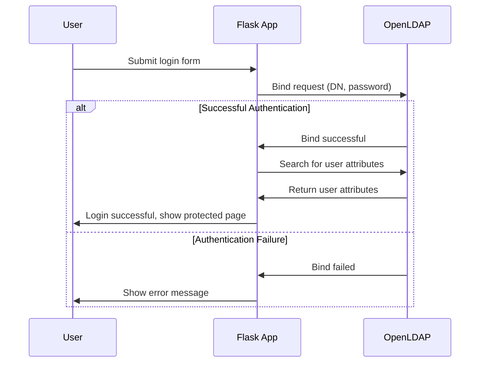

# Flask Authentication Demo

This demo shows how to implement Basic and Digest Authentication in Flask.

## Features

- Basic Authentication implementation with password hashing
- Digest Authentication with nonce-based challenge-response
- Form-based Authentication with session management
- Token-based Authentication using JWT
- LDAP Authentication with direct server binding
- Auth0 Universal Login integration with OAuth 2.0/OIDC
- Auth0 API authentication with audience and scope configuration
- Machine-to-Machine (M2M) authentication flow
- User Authentication Flow with token context
- API protection with token validation and audience verification
- Stateful (Redis-backed) session management
- Stateless token-based authentication with client-side storage
- Multi-Factor Authentication (MFA) using TOTP
- Secure password storage using Werkzeug's password hashing
- Decorator-based authentication for route protection
- In-memory nonce management for Digest Authentication
- Type-annotated Python code for better maintainability
- Simple demo endpoints to showcase all auth methods
- Session cookie debugging tool for educational purposes
- Modern responsive UI with Bootstrap 5
- Persistent navigation bar with login state
- Clean and user-friendly login interface
- Flash messages for user feedback
- Built-in TOTP code generator for demo purposes
- Comprehensive test suite with 96% coverage
- CORS (Cross-Origin Resource Sharing) demonstration
- Interactive examples of browser CORS behavior
- Various CORS configuration techniques
- Preflight request handling examples
- Flask-CORS extension integration
- Testing utilities and scripts for authentication flows

## Setup

1. Create a virtual environment:
```bash
python -m venv venv
source venv/bin/activate  # On Windows: venv\Scripts\activate
```

2. Install dependencies:
```bash
pip install -r requirements.txt
```

3. Start Redis (required for session storage):
```bash
docker-compose up -d
```

4. Run the application:
```bash
python app.py
```

The application will start on http://localhost:5001

## Testing

Run the test suite with coverage report:
```bash
pytest
```

The tests verify:
- Basic Authentication functionality
  - No credentials
  - Invalid credentials
  - Valid credentials
- Digest Authentication functionality
  - No credentials
  - Invalid nonce
  - Valid credentials with proper nonce
- Token Authentication functionality
  - Token generation
  - Protected endpoint access
  - Token validation and expiration
- Form-based Authentication
  - Login/logout flow
  - Session management
  - Protected page access
- Welcome page accessibility

### Debug Session Cookie Tool

A debugging tool is included to help understand Flask's client-side session implementation:

- `/debug/decode-session` - A tool to analyze and decode Flask session cookies
  - Decode existing session cookies to view their contents 
  - Generate sample session cookies with test data
  - Examine session cookie structure (payload, timestamp, signature)
  - Verify cookie signatures with the current app secret key

This tool is useful for:
- Understanding how Flask secures session data
- Troubleshooting session-related issues
- Learning about cookie-based authentication
- Teaching web security concepts

⚠️ **Important**: This endpoint should be disabled in production as it uses the application's secret key.

#### Using the Debug Session Cookie Tool

To use the debug tool:

1. Start the application and log in to create a session
2. Visit `/debug/decode-session` in your browser
3. To decode an existing cookie:
   - Get your session cookie from browser Developer Tools
   - Paste it into the text area
   - Click "Decode Cookie"
4. To generate a test cookie:
   - Click "Generate Test Cookie" 
   - The tool will create a sample cookie with predefined session data
   - You can then examine the cookie structure and contents

This tool visually breaks down the three components of Flask's signed cookies:
- The base64-encoded session data payload
- The timestamp indicating when the cookie was created
- The cryptographic signature that ensures data integrity

## Session Management

The application uses Redis for server-side session storage. This provides several advantages over Flask's default client-side sessions:

1. **Security**: Session data is stored on the server, not in cookies
2. **Scalability**: Session data can be shared across multiple application instances
3. **Control**: Sessions can be invalidated server-side (e.g., for logout or security purposes)
4. **Size**: Not limited by cookie size restrictions

### Session Configuration

Session configuration is defined in `app.py` with these settings:

- `SESSION_TYPE='redis'`: Uses Redis for session storage
- `SESSION_PERMANENT=False`: Sessions expire when browser is closed
- `SESSION_USE_SIGNER=True`: Encrypts the session cookie identifier
- `SESSION_KEY_PREFIX='session:'`: Prefix for session keys in Redis
- `SESSION_REDIS`: Connection to Redis instance

### Redis Session Inspection

To inspect active sessions in Redis:

```bash
# Connect to Redis container
docker exec -it flask_auth_redis redis-cli

# List all session keys
keys session:*

# View a session's content 
get session:[key]
```

### Redis Session Debug Tool

A debug endpoint is available to view and decode Redis session data:

- `/debug/redis-session` - Provides JSON output with:
  - Your current session ID
  - Your current session data
  - All sessions stored in Redis

This tool automatically decodes the binary pickle data stored in Redis into readable JSON format, showing you exactly what data is stored in your session.

⚠️ **Important**: This endpoint should be disabled in production as it exposes all session data.

## Usage

The demo provides these endpoints:

- `/` - Welcome page (no authentication)
- `/basic` - Protected by Basic Authentication
- `/digest` - Protected by Digest Authentication
- `/form` - Protected by Form-based Authentication with session management
- `/login` - Login page for form-based authentication
- `/logout` - Logout endpoint for form-based authentication
- `/setup-mfa` - Setup Multi-Factor Authentication
- `/verify-mfa` - Verify MFA code
- `/token-login` - Login page for JWT token-based authentication (stateless)
- `/token-protected` - Protected page that uses client-side JWT token
- `/api/token` - Get JWT token using Basic Authentication
- `/api/protected` - Protected endpoint requiring JWT token
- `/api/token-data` - Protected API endpoint for the stateless UI
- `/api/auth0-protected` - Protected API endpoint requiring Auth0 token
- `/ldap-login` - Login page for LDAP authentication
- `/ldap-protected` - Protected page requiring LDAP authentication
- `/auth0/login` - Initiates Auth0 Universal Login flow
- `/auth0/callback` - Callback URL for Auth0 authentication
- `/auth0/token-callback` - Callback URL for Auth0 token authentication
- `/auth0/profile` - Protected page requiring Auth0 authentication
- `/auth0/logout` - Logout endpoint for Auth0 authentication
- `/debug/decode-session` - Debug tool for analyzing Flask session cookies
- `/debug/redis-session` - Debug tool for viewing Redis session data

Default credentials:
- Username: `admin`
- Password: `secret`

For LDAP authentication, use these test credentials:
- Username: `john.doe` / Password: `password123`
- Username: `jane.smith` / Password: `password456`

### Multi-Factor Authentication

The demo includes a simplified MFA implementation using Time-based One-Time Passwords (TOTP). For demonstration purposes, the app includes its own TOTP code generator, but in a real application, you would use an authenticator app like Google Authenticator or Authy.

To set up MFA:
1. Log in to the application
2. Visit the protected page
3. Click "Setup MFA"
4. You'll see your secret key and a demo TOTP generator
5. Enter the current 6-digit code to verify and enable MFA

Once MFA is enabled:
1. Login requires both password and current TOTP code
2. The demo TOTP generator can be used to generate valid codes
3. Protected pages require MFA verification

Note: In a production environment, you would:
- Use QR codes for secret sharing
- Store MFA secrets securely
- Implement backup codes
- Add MFA recovery options

### Token-based Authentication

Token-based Authentication uses JSON Web Tokens (JWT) for stateless authentication. Upon successful login, the server issues a signed JWT containing user information and claims. This token is then included in the Authorization header of subsequent requests using the Bearer scheme. Benefits include:

- Stateless authentication requiring no server-side session storage
- Built-in expiration and claim verification
- Cross-domain/CORS support
- Suitable for both web applications and APIs
- Efficient scaling in distributed systems

This demo includes two token-based authentication implementations:

1. **API-based implementation** (`/api/token` and `/api/protected`):
   - Get a token using Basic Authentication
   - Use the token in the Authorization header for API requests

2. **UI-based implementation** (`/token-login` and `/token-protected`):
   - Login via a web form to get a JWT token
   - Token is stored in browser's localStorage
   - Client-side JavaScript handles authentication
   - Complete UI flow demonstration without server-side state

Key features of the JWT implementation:
- Tokens expire after 1 hour
- Uses HS256 (HMAC with SHA-256) for signing
- Includes username and expiration claims
- Requires Bearer token scheme in Authorization header

## Authentication Methods

### Basic Authentication

Basic Authentication sends credentials with each request encoded in base64. While simple to implement, it should only be used over HTTPS to prevent credential exposure.

### Digest Authentication

Digest Authentication provides better security by sending a hash of the credentials instead of the credentials themselves. It uses nonces to prevent replay attacks.

### Form-based Authentication

Form-based Authentication provides a user-friendly login interface that matches the application's design. It uses session management to maintain user state and provides feedback through flash messages. This method is ideal for web applications where user experience is a priority.

### LDAP Authentication

LDAP (Lightweight Directory Access Protocol) Authentication uses an external directory service to verify user credentials. The demo implements direct LDAP authentication:

1. The application connects directly to an OpenLDAP server
2. User credentials are verified by attempting to bind (authenticate) to the LDAP server
3. If successful, the user's attributes are retrieved and displayed
4. Session management is used to maintain authentication state

#### LDAP Authentication Flow



#### LDAP Implementation Details

- Uses the `python-ldap` library to connect to the LDAP server
- Authentication performed by binding to the LDAP server with user credentials
- User attributes retrieved using LDAP search operations
- Includes a dockerized OpenLDAP server for demonstration
- Includes phpLDAPadmin for directory management (available at http://localhost:8080)
- LDAP server runs on non-privileged port 10389

To use the LDAP Management Interface:
1. Visit http://localhost:8080 in your browser
2. Login with:
   - Login DN: `cn=admin,dc=example,dc=org`
   - Password: `admin_password`

### Auth0 Universal Login

Auth0 Universal Login provides a complete authentication solution that can be quickly integrated into any application. This demo implements the Auth0 integration using the Authorization Code Flow with PKCE, which is recommended for web applications.

#### Auth0 Authentication Flow

1. User clicks "Login with Auth0" and is redirected to Auth0's login page
2. Auth0 handles user authentication (including social logins if configured)
3. After successful authentication, Auth0 redirects back to the application with an authorization code
4. The application exchanges this code for tokens (ID token, access token)
5. The application uses the access token to fetch user profile information
6. User information is stored in the session for subsequent requests

#### Auth0 Setup

To use Auth0 with this demo:

1. Create a free Auth0 account at [auth0.com](https://auth0.com)
2. Create a Regular Web Application in the Auth0 Dashboard
3. Configure the application with these settings:
   - Allowed Callback URLs: `http://127.0.0.1:5001/auth0/callback,http://127.0.0.1:5001/auth0/token-callback`
   - Allowed Logout URLs: `http://127.0.0.1:5001`
   - Allowed Web Origins: `http://127.0.0.1:5001`
4. Update the `.env` file with your Auth0 credentials:
   ```
   AUTH0_CLIENT_ID=your_client_id
   AUTH0_CLIENT_SECRET=your_client_secret
   AUTH0_DOMAIN=your-tenant.auth0.com
   AUTH0_CALLBACK_URL=http://127.0.0.1:5001/auth0/callback
   ```

#### Auth0 API Setup

For API authentication, additional configuration is required:

1. Create an API in Auth0 Dashboard with identifier (audience) and permissions
2. Create a Machine-to-Machine application or configure existing application
3. Set additional environment variables:
   ```
   # Auth0 API Configuration
   AUTH0_API_AUDIENCE=https://api.example.com
   
   # Auth0 Machine-to-Machine Client (for API access)
   AUTH0_M2M_CLIENT_ID=your-m2m-client-id
   AUTH0_M2M_CLIENT_SECRET=your-m2m-client-secret
   ```

#### Auth0 API Authentication Flows

The demo shows two authentication flows for API access:

1. **User Authentication Flow**
   - Redirects to Auth0 login
   - Produces a token with user context
   - Uses authorization code flow with PKCE

2. **Machine-to-Machine Flow**
   - Uses client credentials to get a token without user interaction
   - Ideal for server-to-server communication
   - Can be tested with included script or curl commands

#### Testing Auth0 API Authentication

For convenience, use the included test script:

```bash
# Make the script executable (if needed)
chmod +x test_auth0_api.sh

# Run the test
./test_auth0_api.sh
```

The script will get an access token and call the protected API endpoint.

#### Benefits of Auth0 Integration

- Fully customizable login and registration pages
- Support for social logins (Google, Facebook, GitHub, etc.)
- Enterprise connections (LDAP, Active Directory, SAML)
- Advanced security features like Brute Force Protection
- Multi-factor Authentication (MFA)
- Centralized user management dashboard
- Detailed authentication logs and analytics
- API authentication with audience and scope support
- Machine-to-Machine authentication for server communication

For more information, refer to the [Auth0 Setup Guide](auth0_setup_guide.md).

## CORS Demo

The project includes a demonstration of Cross-Origin Resource Sharing (CORS) mechanisms.

### What is CORS?

CORS (Cross-Origin Resource Sharing) is a security mechanism built into web browsers that restricts web pages from making requests to a different domain than the one that served the original web page. It's an extension of the Same-Origin Policy.

### CORS Demo Setup

This demo consists of two Flask applications:

1. **API Server** (api_server.py) - Runs on port 5002
   - Provides various API endpoints with different CORS configurations
   - Demonstrates various ways to enable and configure CORS

2. **Client Application** (client_app.py) - Runs on port 5003
   - Simple web UI that makes requests to the API Server
   - Demonstrates how browsers handle cross-origin requests

### Running the CORS Demo

1. Start the API Server (in one terminal):
   ```bash
   python api_server.py
   ```

2. Start the Client Application (in another terminal):
   ```bash
   python client_app.py
   ```

3. Open your browser and navigate to:
   ```
   http://localhost:5003
   ```

4. Use the buttons on the page to test different CORS scenarios

Alternatively, you can use the provided convenience script to start both servers automatically:

```bash
# Make the script executable first (if needed)
chmod +x run_cors_demo.sh

# Run the script
./run_cors_demo.sh
```

The script will launch both the API Server and Client Application in separate terminal windows, allowing you to quickly get started with the demo.

### CORS Demo Scenarios

The demo covers the following scenarios:

1. **No CORS Headers**
   - Request fails due to Same-Origin Policy
   - Browser blocks the request with CORS error

2. **CORS Enabled for All Origins**
   - API adds `Access-Control-Allow-Origin: *` header
   - Request succeeds for any origin

3. **CORS Enabled for Specific Origin**
   - API adds `Access-Control-Allow-Origin: http://localhost:5003` header
   - Request succeeds only from that specific origin

4. **Complex Request with Preflight**
   - Demonstrates preflight OPTIONS request for non-simple requests
   - API handles OPTIONS request with proper CORS headers

5. **Using Flask-CORS Extension**
   - Shows how to use the Flask-CORS extension for easier CORS configuration

### CORS Learning Points

- CORS is a browser security mechanism (the server always processes the request)
- For cross-origin requests to succeed, the server must explicitly allow them
- Different types of requests may require different CORS configurations
- Non-simple requests trigger an automatic preflight (OPTIONS) request

### Recommended Tools for CORS Inspection

To fully understand what's happening:

1. Open your browser's Developer Tools (F12)
2. Go to the Network tab
3. Watch the requests as you click the demo buttons
4. Inspect the request headers, response headers, and error messages