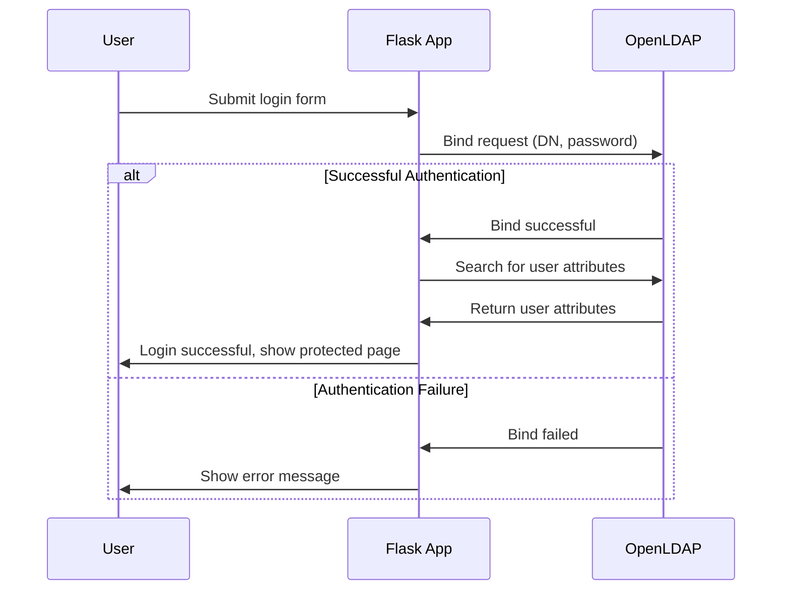

# LDAP Authentication Demo

This demo shows direct LDAP authentication in a Flask application using OpenLDAP in Docker.

## Setup

1. Build and start the containers:
   ```
   docker-compose up -d
   ```

2. Wait for the OpenLDAP and phpLDAPadmin containers to initialize

3. Start the Flask application:
   ```
   python app.py
   ```
   
4. Visit http://localhost:5001 in your browser and click on "Try LDAP Login"

## Default Test Users

The LDAP directory is pre-populated with two test users:

1. **John Doe**
   - Username: `john.doe`
   - Password: `password123`

2. **Jane Smith**
   - Username: `jane.smith`
   - Password: `password456`

## LDAP Management Interface

You can use phpLDAPadmin to manage the LDAP directory:

1. Visit http://localhost:8080 in your browser
2. Login with:
   - Login DN: `cn=admin,dc=example,dc=org`
   - Password: `admin_password`
3. Note that the LDAP server is running on port 10389 (not the default 389)

## How It Works

This demo implements direct LDAP authentication as described in Section 4.4.1:

1. The application connects directly to the LDAP server
2. User credentials are verified by attempting to bind (authenticate) to the LDAP server
3. If successful, the user's attributes are retrieved and displayed
4. No additional authentication factors are required (unlike the main demo)

### LDAP Authentication Flow



## Implementation Details

- The app uses the `python-ldap` library to connect to the LDAP server
- User authentication is performed by binding to the LDAP server with the provided credentials
- User attributes are retrieved using an LDAP search operation
- The session is used to store authentication state
- No password hashing or additional security is implemented as this is just a demo
- LDAP server runs on non-privileged port 10389 (mapped from standard port 389 inside the container) 